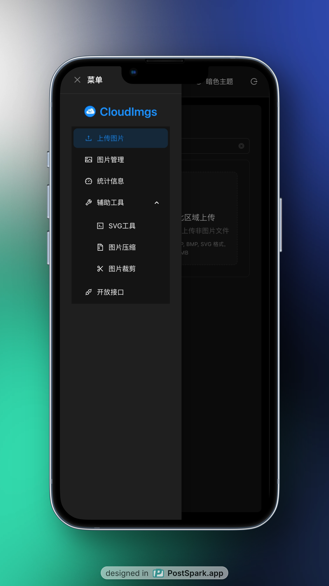

# CloudImgs - 简单、方便的开源图床项目，支持 NAS 部署

## 软件预览

| 桌面端                                               | 移动端                                                     |
| ---------------------------------------------------- | ---------------------------------------------------------- |
|  |  |

一个简单、方便的开源图床项目，一键 NAS 部署，支持图片上传、管理、预览和分享。

## 功能特性

### 🚀 核心功能

- **图片上传**: 支持拖拽上传，多种图片格式
- **图片管理**: 浏览、预览、下载、删除图片
- **图片分享**: 一键复制图片链接
- **统计信息**: 实时显示存储使用情况

### 🔐 密码保护

- **访问控制**: 可设置访问密码，保护图片安全
- **登录界面**: 美观的登录界面，支持密码验证
- **会话管理**: 登录状态自动保存，支持退出登录
- **API 保护**: 所有管理接口都需要密码验证
- **可选启用**: 通过环境变量控制是否启用密码保护

### 📁 子目录管理

- **智能目录选择**: 可选择现有目录或输入新目录
- **目录信息展示**: 在图片管理页面显示当前目录信息
- **目录统计**: 支持按目录统计图片数量和存储大小

### 🔧 SVG 工具

- **SVG 转 PNG**: 输入 SVG 代码，实时转换为 PNG 图片
- **在线预览**: 转换后立即预览 PNG 效果
- **一键上传**: 转换完成后直接上传到图床
- **批量下载**: 支持下载转换后的 PNG 图片
- **示例代码**: 提供常用 SVG 示例代码
- **自定义文件名**: 支持自定义上传和下载的文件名
- **自动生成文件名**: 基于时间戳自动生成文件名

### 🗜️ 图片压缩工具

- **Canvas 压缩**: 基于 Canvas API 进行高质量图片压缩
- **尺寸调整**: 支持设置压缩后的宽度和高度
- **宽高比锁定**: 自动保持原始图片的宽高比例
- **质量调节**: 1-100% 可调节压缩质量
- **实时预览**: 压缩后立即预览效果
- **压缩信息**: 显示原始大小、压缩后大小和压缩率
- **一键上传**: 压缩完成后直接上传到图床
- **本地下载**: 支持下载压缩后的图片
- **智能默认**: 根据原始图片自动计算合适的压缩尺寸

### 🌓 主题切换功能

- **多主题支持**: 支持浅色主题和暗色主题
- **自动模式**: 根据系统时间自动切换主题（6:00-18:00 浅色，18:00-6:00 暗色）
- **手动切换**: 支持手动选择浅色、暗色或自动模式
- **主题持久化**: 主题设置自动保存到本地存储
- **实时切换**: 主题切换立即生效，无需刷新页面
- **全面适配**: 所有页面和组件都完美适配两种主题
- **优雅动画**: 主题切换时有平滑的过渡效果

### 📱 移动端适配

- **响应式布局**: 基于 Ant Design Grid 系统的完美响应式设计
- **移动端导航**: 移动端使用抽屉式菜单，提供更好的触摸体验
- **自适应布局**: 根据屏幕尺寸自动调整布局和组件大小
- **触摸优化**: 按钮和交互元素针对移动端触摸操作进行优化
- **图片管理**: 移动端图片网格自动调整为单列布局
- **API 文档**: 移动端代码示例和文档自动适配小屏幕
- **主题适配**: 移动端完美支持浅色和暗色主题切换

## 快速开始

### 快速部署 - docker-compose.yml

```yaml
version: "3.8"

services:
  cloudimgs:
    image: qazzxxx/cloudimgs:latest
    ports:
      - "3001:3001"
    volumes:
      - ./uploads:/app/uploads:rw # 上传目录配置，明确读写权限
    restart: unless-stopped
    container_name: cloudimgs-app
    # 使用 root 用户运行以解决权限问题
    user: "root"
    environment:
      - NODE_ENV=production
      - PORT=3001
      - STORAGE_PATH=/app/uploads
      # 密码保护配置（可选）
      # - PASSWORD=your_secure_password_here
```

### 密码保护配置

如需启用密码保护，请在环境变量中设置 `PASSWORD`：

```bash
environment:
  - PASSWORD=your_secure_password_here
```

**注意事项：**

- 设置 `PASSWORD` 环境变量后，系统将自动启用密码保护
- 未设置 `PASSWORD` 时，系统无需密码即可访问
- 密码验证成功后，登录状态会保存在浏览器本地存储中

## API 接口文档

### 📤 图片上传

**接口地址：** `POST /api/upload`

**认证要求：** 如果启用了密码保护，需要提供访问密码

| 参数名   | 类型   | 必填 | 描述                           |
| -------- | ------ | ---- | ------------------------------ |
| image    | file   | 是   | 要上传的图片文件               |
| dir      | string | 否   | 存储目录路径（支持多层目录）   |
| password | string | 是\* | 访问密码（如果启用了密码保护） |

**支持格式：** JPG, PNG, GIF, WebP, BMP, SVG  
**文件大小限制：** 最大 10MB

**响应示例：**

```json
{
  "success": true,
  "message": "图片上传成功",
  "data": {
    "filename": "image.jpg",
    "originalName": "原始文件名.jpg",
    "size": 1024000,
    "mimetype": "image/jpeg",
    "uploadTime": "2024-01-01T12:00:00.000Z",
    "url": "/api/images/image.jpg",
    "relPath": "image.jpg"
  }
}
```

### 📋 获取图片列表

**接口地址：** `GET /api/images`

**认证要求：** 如果启用了密码保护，需要提供访问密码

| 参数名   | 类型   | 必填 | 描述                           |
| -------- | ------ | ---- | ------------------------------ |
| dir      | string | 否   | 指定目录路径（支持多层目录）   |
| password | string | 是\* | 访问密码（如果启用了密码保护） |

**响应示例：**

```json
{
  "success": true,
  "data": [
    {
      "filename": "image.jpg",
      "relPath": "image.jpg",
      "size": 1024000,
      "uploadTime": "2024-01-01T12:00:00.000Z",
      "url": "/api/images/image.jpg"
    }
  ]
}
```

### 🎲 获取随机图片

**接口地址：** `GET /api/random`

**认证要求：** 如果启用了密码保护，需要提供访问密码

| 参数名   | 类型   | 必填 | 描述                                            |
| -------- | ------ | ---- | ----------------------------------------------- |
| dir      | string | 否   | 指定目录路径（支持多层目录）                    |
| format   | string | 否   | 返回格式，json 返回 JSON 数据，否则直接返回图片 |
| password | string | 是\* | 访问密码（如果启用了密码保护）                  |

**响应格式：**

- 当 `format=json` 时返回 JSON 数据
- 否则直接返回图片文件

### 📁 获取目录列表

**接口地址：** `GET /api/directories`

**认证要求：** 如果启用了密码保护，需要提供访问密码

| 参数名   | 类型   | 必填 | 描述                           |
| -------- | ------ | ---- | ------------------------------ |
| dir      | string | 否   | 指定目录路径（支持多层目录）   |
| password | string | 是\* | 访问密码（如果启用了密码保护） |

**响应示例：**

```json
{
  "success": true,
  "data": [
    {
      "name": "2024",
      "path": "2024",
      "fullPath": "/app/uploads/2024"
    }
  ]
}
```

### 📊 获取统计信息

**接口地址：** `GET /api/stats`

**认证要求：** 如果启用了密码保护，需要提供访问密码

| 参数名   | 类型   | 必填 | 描述                           |
| -------- | ------ | ---- | ------------------------------ |
| dir      | string | 否   | 指定目录路径（支持多层目录）   |
| password | string | 是\* | 访问密码（如果启用了密码保护） |

**响应示例：**

```json
{
  "success": true,
  "data": {
    "totalImages": 100,
    "totalSize": 104857600,
    "storagePath": "/app/uploads"
  }
}
```

### 🗑️ 删除图片

**接口地址：** `DELETE /api/images/{path}`

**认证要求：** 如果启用了密码保护，需要提供访问密码

| 参数名   | 类型   | 必填 | 描述                           |
| -------- | ------ | ---- | ------------------------------ |
| path     | string | 是   | 图片路径（URL 路径参数）       |
| password | string | 是\* | 访问密码（如果启用了密码保护） |

**响应示例：**

```json
{
  "success": true
}
```

### 📖 获取指定图片

**接口地址：** `GET /api/images/{path}`

**认证要求：** 无需认证

| 参数名 | 类型   | 必填 | 描述                     |
| ------ | ------ | ---- | ------------------------ |
| path   | string | 是   | 图片路径（URL 路径参数） |

**响应格式：** 直接返回图片文件

## 使用示例

### 1. 上传图片（使用 curl）

```bash
# 上传到根目录（无密码保护）
curl -X POST http://localhost:3001/api/upload \
  -F "image=@/path/to/your/image.jpg"

# 上传到根目录（有密码保护）
curl -X POST http://localhost:3001/api/upload \
  -H "X-Access-Password: your_password" \
  -F "image=@/path/to/your/image.jpg"

# 上传到指定子目录（有密码保护）
curl -X POST "http://localhost:3001/api/upload?dir=2024/06/10" \
  -H "X-Access-Password: your_password" \
  -F "image=@/path/to/your/image.jpg"
```

### 2. 获取图片列表（使用 fetch）

```javascript
// 获取根目录所有图片（无密码保护）
fetch("/api/images")
  .then((response) => response.json())
  .then((data) => console.log(data));

// 获取根目录所有图片（有密码保护）
fetch("/api/images", {
  headers: {
    "X-Access-Password": "your_password",
  },
})
  .then((response) => response.json())
  .then((data) => console.log(data));

// 获取指定目录图片（有密码保护）
fetch("/api/images?dir=2024/06/10", {
  headers: {
    "X-Access-Password": "your_password",
  },
})
  .then((response) => response.json())
  .then((data) => console.log(data));
```

### 3. 获取随机图片

```javascript
// 直接获取图片文件
;

// 获取JSON格式的图片信息
fetch("/api/random?format=json&password=your_password")
  .then((response) => response.json())
  .then((data) => console.log(data));
```

### 4. 删除图片

```bash
# 删除图片（无密码保护）
curl -X DELETE http://localhost:3001/api/images/image.jpg

# 删除图片（有密码保护）
curl -X DELETE -H "X-Access-Password: your_password" http://localhost:3001/api/images/image.jpg
```
