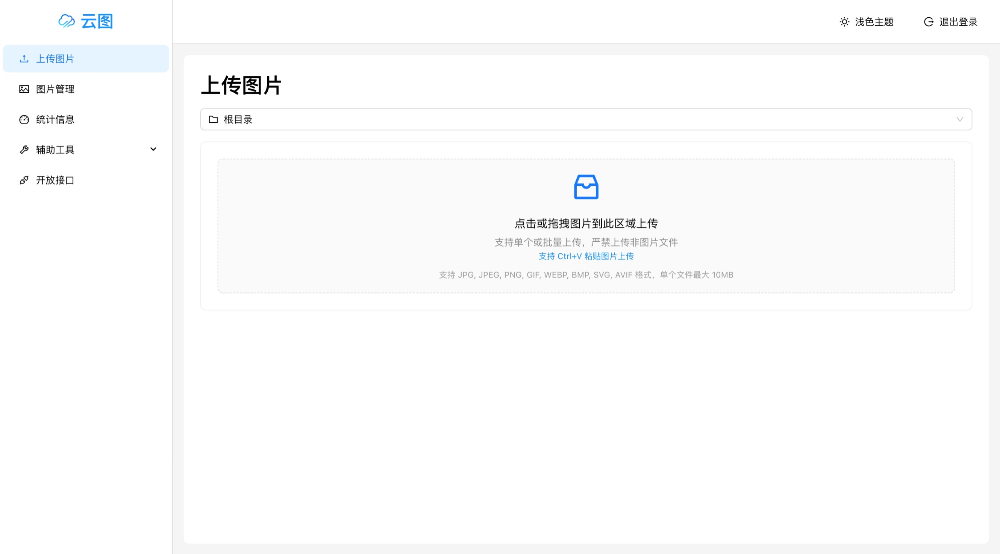
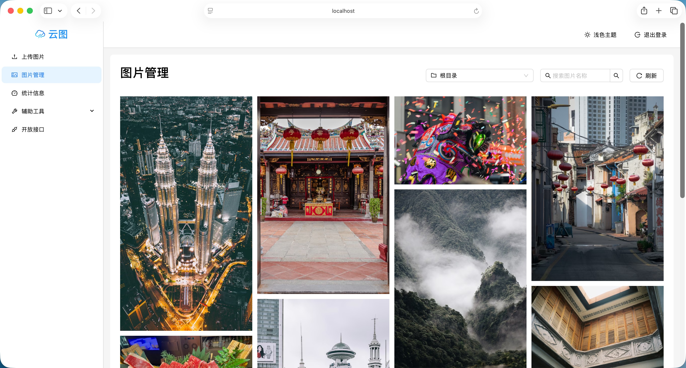
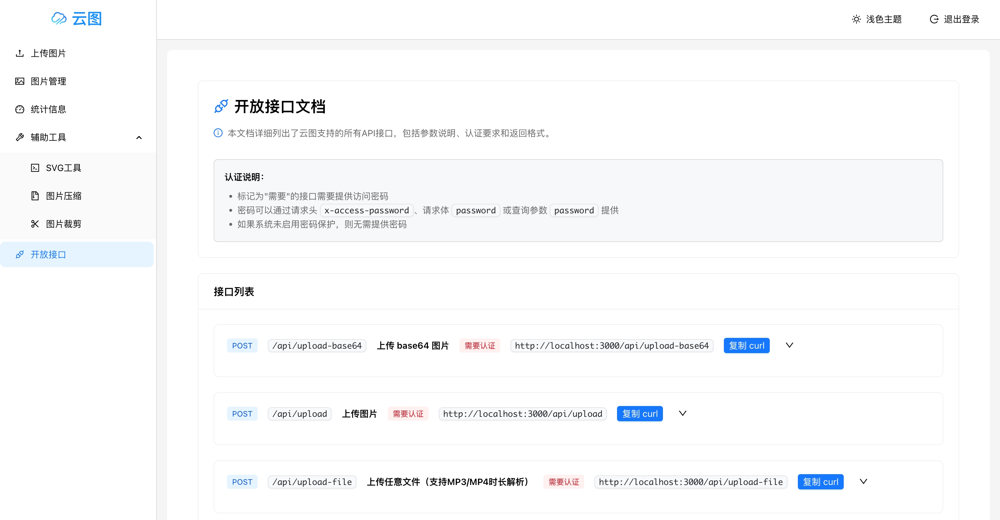

## 云图 - 简单、方便的无数据库图床项目，支持 NAS 部署，支持各种灵活的API开放接口

[](https://github.com/qazzxxx/cloudimgs/stargazers)
[](https://github.com/qazzxxx/cloudimgs/network/members)
[](https://github.com/qazzxxx/cloudimgs/releases)

> 项目的开始是用 **N8N处理相关流程** 时有很多图片处理的需求，找了很多开源项目有的比较老无人维护，有的需要购买PRO版本才能有更多的功能。以上种种原因吧，再加上自己也有NAS，所以写了一个比较自由开放的图床项目。Ta是一个简单、方便的无数据库图床项目，一键 NAS 部署，支持设置密钥，支持各种灵活的API开放接口

## 🚀 功能特点

- [x] 支持各种灵活开放API
- [x] 图片上传，多图拖拽一键上传
- [x] 支持压缩图片大小
- [x] 支持URL参数实时处理图片 （如：image.jpg?w=500&h=300&q=80&fmt=webp 自动将原图转换为WebP 、宽500px，高300px，图片质量压缩到80% 返回）
- [x] 支持上传其他文件格式
- [x] 在线管理图片，瀑布流展示
- [x] 支持设置密钥，保护图片安全
- [x] 支持多级子目录管理
- [x] 支持 SVG 图片转换为 PNG 格式
- [x] 支持图片压缩工具，可自定义压缩质量和尺寸
- [x] 支持图片分享，一键复制图片链接
- [x] 支持多主题样式切换
- [x] 移动端适配
- [x] 更多功能，等你来发现

## 软件预览
登录页面


上传图片页面


图片管理页面



开放接口页面



## 快速开始

### 快速部署 - docker-compose.yml

```yaml
services:
  cloudimgs:
    image: qazzxxx/cloudimgs:latest
    ports:
      - "3001:3001"
    volumes:
      - ./uploads:/app/uploads:rw # 上传目录配置，明确读写权限
    restart: unless-stopped
    container_name: cloudimgs-app
    # 使用 root 用户运行以解决权限问题
    user: "root"
    environment:
      - NODE_ENV=production
      - PORT=3001
      - STORAGE_PATH=/app/uploads
      # 密码保护配置（可选）
      # - PASSWORD=your_secure_password_here
```

### 密码保护配置

如需启用密码保护，请在环境变量中设置 `PASSWORD`：

```bash
environment:
  - PASSWORD=your_secure_password_here
```

**注意事项：**

- 设置 `PASSWORD` 环境变量后，系统将自动启用密码保护
- 未设置 `PASSWORD` 时，系统无需密码即可访问
- 密码验证成功后，登录状态会保存在浏览器本地存储中

## Star History

[](https://www.star-history.com/#qazzxxx/cloudimgs&type=date&legend=top-left)