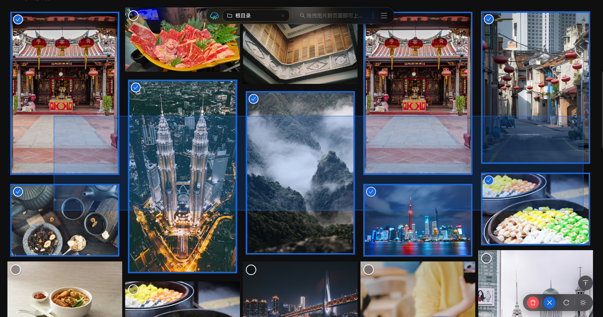
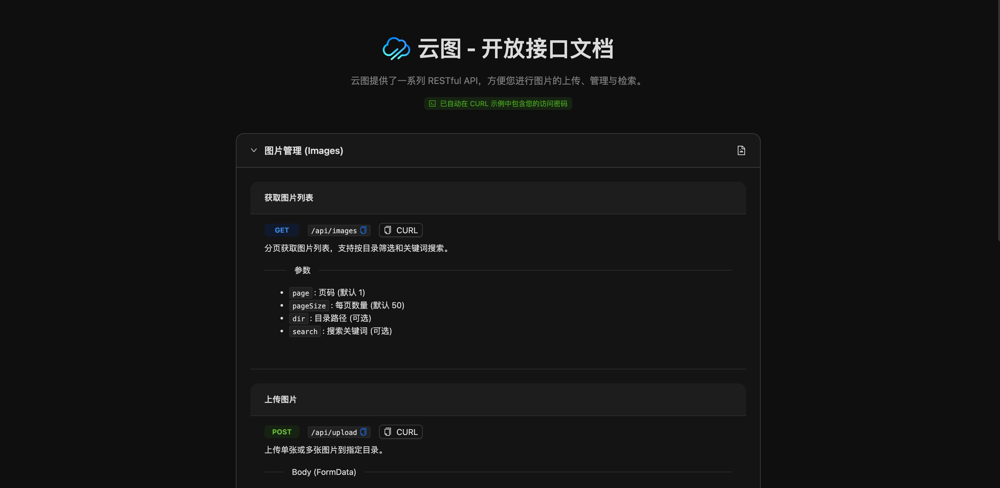

# 云图 - CloudImgs

> ☁️ **云端一隅，拾光深藏**  
> 一个简单、开放且强大的自托管图像托管解决方案。

[](https://github.com/qazzxxx/cloudimgs/stargazers)
[](https://github.com/qazzxxx/cloudimgs/network/members)
[](https://github.com/qazzxxx/cloudimgs/releases)

---

## 📖 简介 | Introduction

项目的开始是用 **N8N处理相关流程** 时有很多图片处理的需求，找了很多开源项目有的比较老无人维护，有的需要购买PRO版本才能有更多的功能。以上种种原因吧，再加上自己也有NAS，所以写了一个比较自由开放的图床项目。

---

## 🖥️ 在线演示 | Demo

- **演示地址**：[https://yt.qazz.site](https://yt.qazz.site)
- **文档地址**：[https://ytdoc.qazz.site/](https://ytdoc.qazz.site/)

> [!NOTE]
> 此演示为 **纯静态 Mock 模式** 部署，图片数据随机加载，不涉及真实后端调用。
> - **访问密码**：`123456`
> - **说明**：上传、删除等操作仅演示UI交互，数据不会保存，部分功能不可用。真实环境下通过 `thumbhash` 生成缩略图，体验会更流畅。

---

## 🚀 功能特点 | Features

### 🛠️ 核心功能
- [x] **多格式支持**：支持上传各种格式图片及其他文件，支持全局上传。
- [x] **图片管理**：在线管理图片，瀑布流展示，批量圈选删除。
- [x] **相册分享**：支持相册分享功能。
- [x] **安全保护**：支持设置密钥，保护图片安全。
- [x] **目录管理**：支持多级子目录管理。
- [x] **移动适配**：完美适配移动端。

### ⚡️ 高级特性
- [x] **魔法搜索**：基于CLIP本地小模型，支持自然语言搜索（如搜“蓝天白云”）。
- [x] **流量看板**：直观展示流量使用情况。
- [x] **照片轨迹**：在地图上展示照片拍摄轨迹。
- [x] **性能优化**：集成 `thumbhash` 无感生成缩略图，大幅优化加载体验。

### 🔌 开放接口 (API)
- [x] **上传/管理**：支持Base64上传、SVG转PNG、拖拽上传、图片删除/列表等。
- [x] **图片处理**：支持实时 URL 参数处理（尺寸、质量、格式转换）。
  - *示例*：`image.jpg?w=500&h=300&q=80&fmt=webp`
- [x] **随机图/指定图**：支持获取随机图片或指定参数的图片。
- [x] **生态集成**：支持 [PicGo 插件](https://github.com/qazzxxx/picgo-plugin-cloudimgs-uploader) 直接安装使用。

### 🎨 图片工具
- [x] **在线编辑**：内置图片编辑功能。
- [x] **格式转换**：支持 SVG 转 PNG。
- [x] **压缩工具**：自定义压缩质量和尺寸。
- [x] **一键分享**：支持一键复制图片链接。

---

## 🖼️ 软件预览 | Preview

<details open>
<summary><b>✨ 点击收起/展开截图</b></summary>
<br>

### 魔法搜索 & 主要界面
| 魔法搜索 (Magic Search) | 登录页面 (Login) |
| :---: | :---: |
|  |  |

| 图片管理 (Management) | 批量操作 (Batch Actions) |
| :---: | :---: |
|  |  |

### 功能展示
| 相册分享 (Share) | 整页上传 (Upload) |
| :---: | :---: |
|  |  |

| 轨迹地图 (Map) | 图片编辑 (Editor) |
| :---: | :---: |
|  |  |

| 开放接口 (API) | 移动端 (Mobile) |
| :---: | :---: |
|  |  |

</details>

---

## 🛠️ 快速部署 | Quick Start

推荐使用 **Docker Compose** 进行快速部署。

### `docker-compose.yml`

```yaml
services:
  cloudimgs:
    image: qazzxxx/cloudimgs:latest
    container_name: cloudimgs-app
    restart: unless-stopped
    ports:
      - "3001:3001"
    volumes:
      - ./uploads:/app/uploads:rw # 上传目录配置，明确读写权限
    environment:
      # 权限配置 (建议填写 NAS 用户真实 ID)
      - PUID=1000  # id -u
      - PGID=1000   # id -g
      - UMASK=002
      
      # 基础配置
      - NODE_ENV=production
      - PORT=3001
      - STORAGE_PATH=/app/uploads
      
      # 可选配置
      # - MAX_FILE_SIZE=104857600 # 最大文件大小，默认 100MB
      # - THUMBNAIL_WIDTH=0 # 瀑布流缩略图宽度（像素），默认 0 表示使用原图
      # - PASSWORD=your_secure_password_here # 🔐 密码保护配置
      # - ENABLE_MAGIC_SEARCH=true # ✨ 开启魔法搜索（使用本地CLIP小模型，占用内存较高）
```

### 🔐 环境变量说明

| 变量名 | 说明 | 示例 / 默认值 |
| :--- | :--- | :--- |
| `PASSWORD` | 设置访问密码，留空则无需密码 | `123456` |
| `ENABLE_MAGIC_SEARCH`| 是否开启 AI 魔法搜索 | `true` / `false` |
| `MAX_FILE_SIZE` | 最大上传文件限制 (Byte) | `104857600` (100MB) |
| `THUMBNAIL_WIDTH` | 列表缩略图宽度 (px) | `0` (原图) / `500` |

> **注意**：
> 1. 设置 `PASSWORD` 后，系统会自动启用登录保护。
> 2. 登录状态会保存在浏览器本地存储中。

---

## 📈 历史 Star | Star History

[](https://www.star-history.com/#qazzxxx/cloudimgs&type=date&legend=top-left)